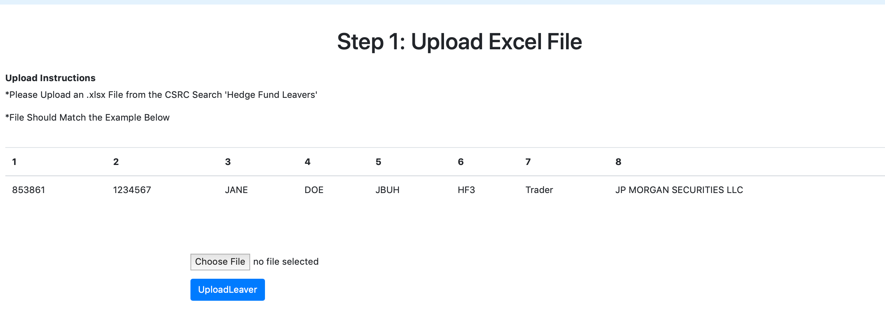
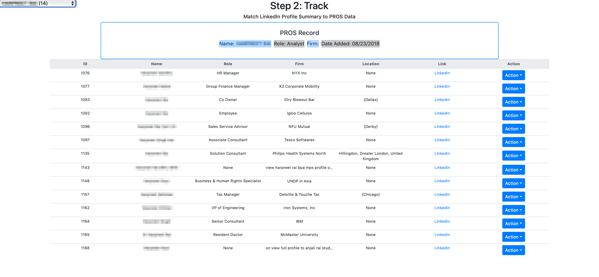
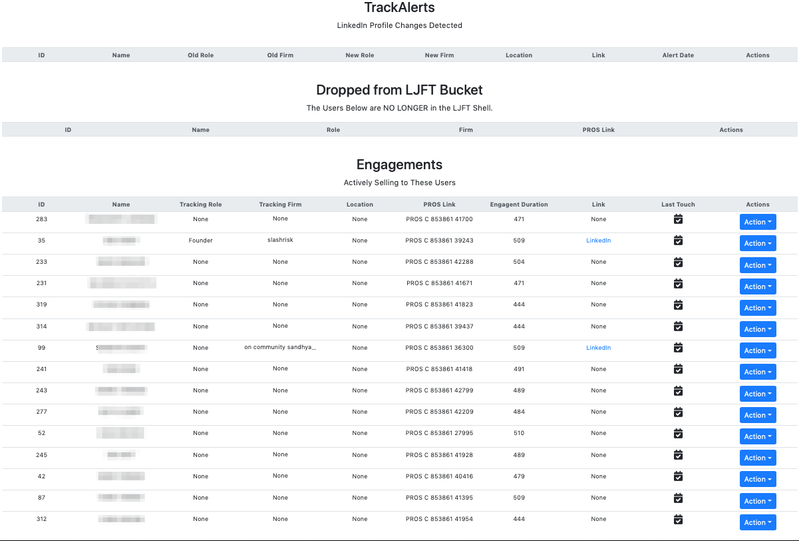
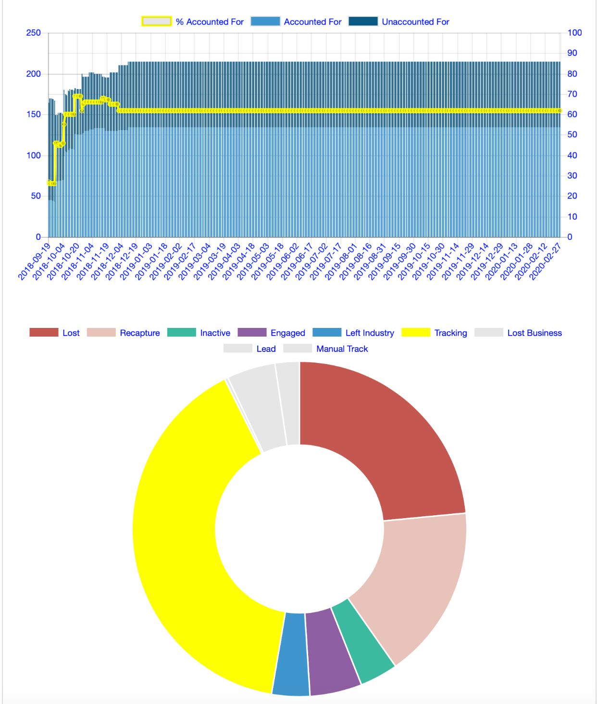
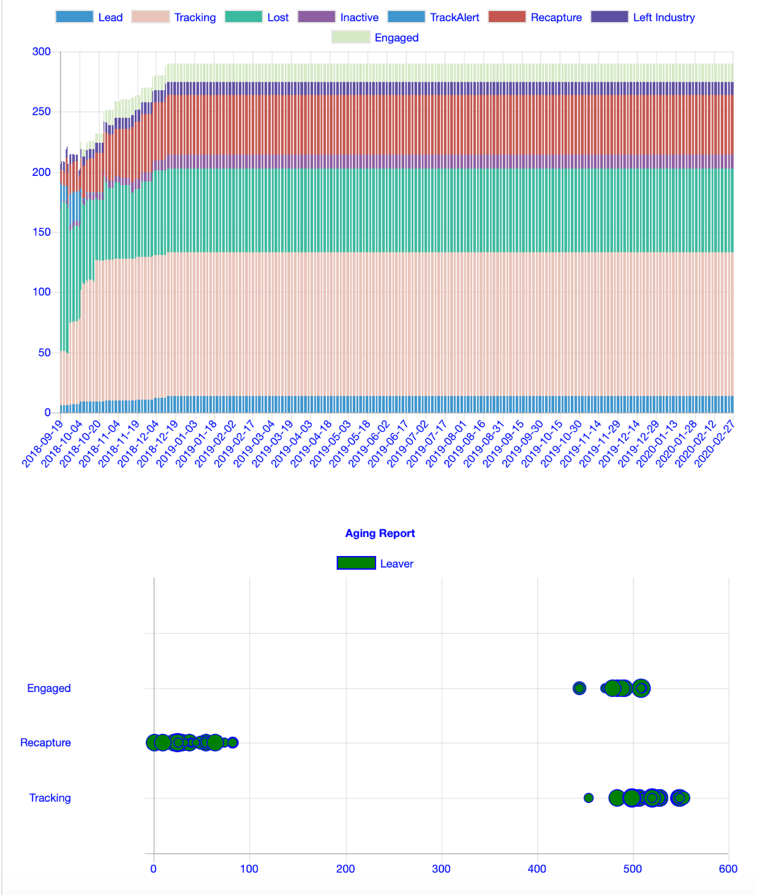
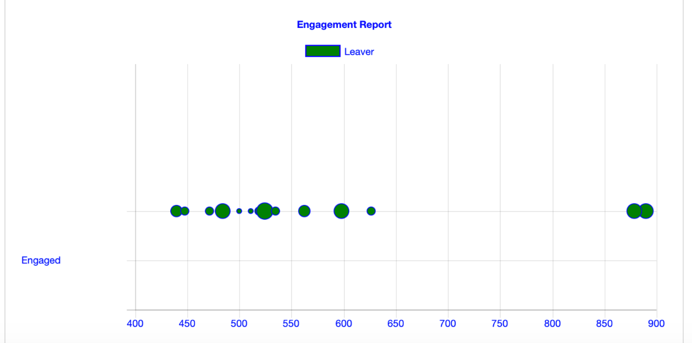

# Search and Rescue

Recapture your B2B Subscribers in Transition with Tracking Updates from SAR. Upload a list of former subscribers to track and recieve notifications when their online profiles change.

## Application Walkthrough

### Upload Lost Customer List from Excel


### ID Your Customer from Potential Matches


### Track Alerts and Manage Engagements using the Dashboard


### Track Group Performance




### Prerequisites

- Recent Python supported version
- Clean Python Environment
- SQLite or Postgres Database for Storage
- Run Locally or Deploy on Heroku


### Installing

Create Directory and Activate Environment

```
mkdir sar && cd sar && pyenv activate [your env name]
```

Clone Repo

```
git clone git@github.com:jdb613/sar3.git
```

Install Dependencies
```
pip install -r requirements.txt
```

Run the Application
```
flask run sar3.py
```

## Deployment

Repo includes a Procfile for Heroku Deployment

## Built With

* [Flask](https://www.fullstackpython.com/flask.html) - The web framework used
* [Scrapy](https://scrapy.org) - Web Scraping
* [SQLAlchemy](https://www.sqlalchemy.org) - ORM
* [Bokeh](https://docs.bokeh.org/en/latest/) - Data Vizualization
* [Bootstrap](https://getbootstrap.com) - HTML/CSS/JS

## Authors

* **Jeff Buhrman** - [GitHub](https://github.com/jdb613)

